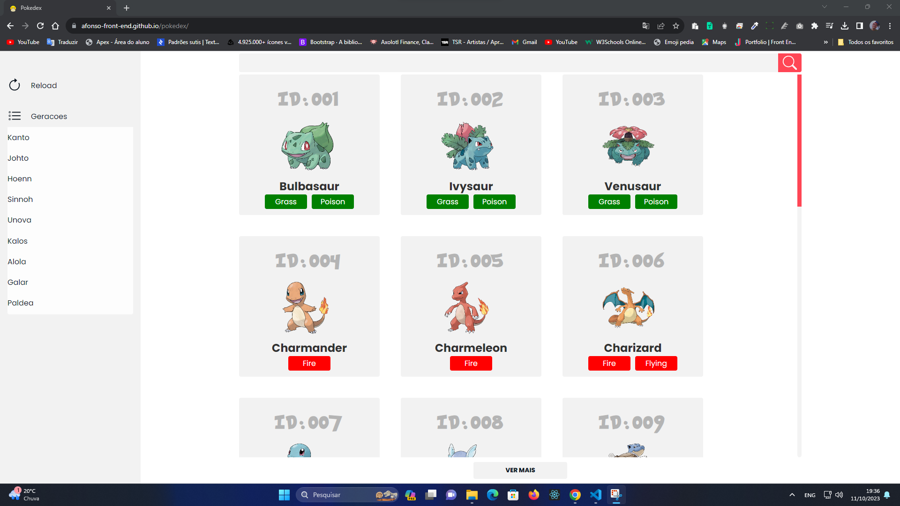
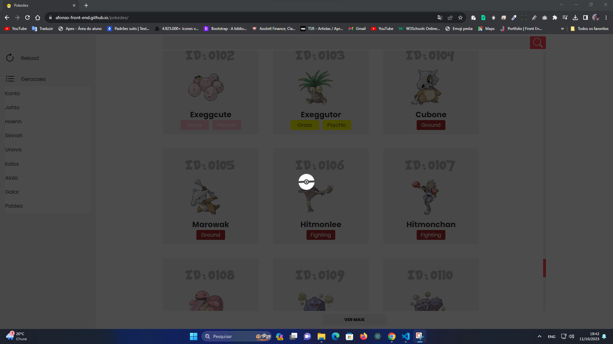
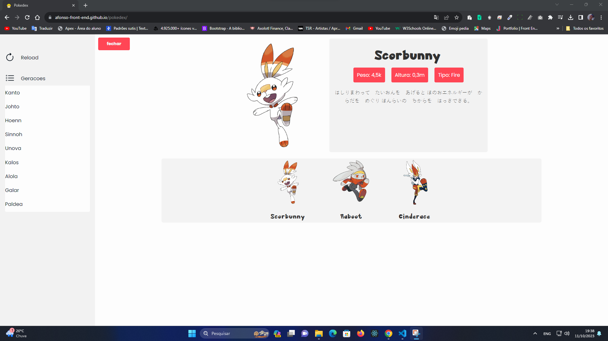
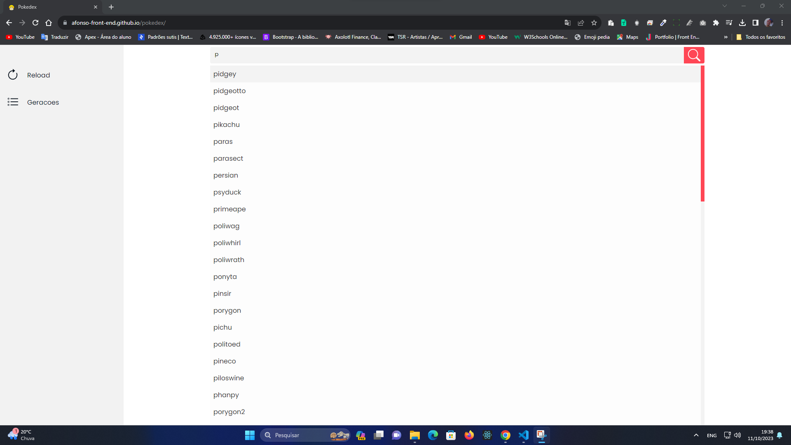

# [Pokedex](https://afonso-front-end.github.io/pokedex/){:target="_blank"}

## Descrição
Este é um projeto de Pokédex que utiliza a API PokeAPI para obter informações detalhadas sobre Pokémon. Com esta aplicação, você pode pesquisar, explorar e aprender mais sobre os Pokémon do mundo.

## Recursos
- Pesquise informações sobre qualquer Pokémon.
- Veja detalhes como tipos, habilidades, estatísticas, evoluções e muito mais.
- Explore uma extensa base de dados de Pokémon.

## Capturas de Tela

## API PokeAPI
Este projeto utiliza a [PokeAPI](https://pokeapi.co/), uma API pública que fornece informações abrangentes sobre Pokémon. Certifique-se de revisar a documentação da API para entender melhor como as solicitações podem ser feitas e quais dados estão disponíveis.

## Licença
Este projeto é distribuído sob a licença MIT. Consulte o arquivo [LICENSE](LICENSE) para obter detalhes.

## Contato
Se você tiver alguma dúvida ou precisar de assistência, sinta-se à vontade para entrar em contato:

- Nome: Afonso
- Email: afonso.silva.as73@gmail.com
Este projeto ainda esta em desenvolvimento! obg <3

